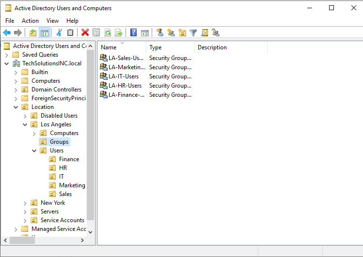
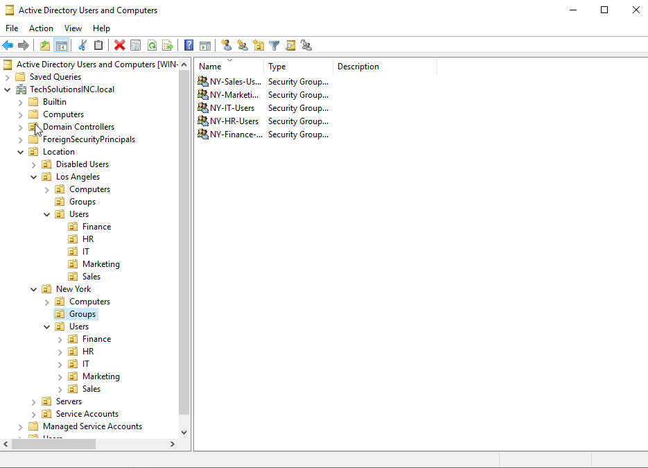

# Overview
After building out the OU structure, I started creating users and security groups by department. Each department had its own groups for different access levels (Read Only and Read/Write). I followed a simplified AGDLP approach by putting users into department groups, then nesting those into resource access groups. My goal was to avoid assigning permissions individually to users. 
  
  

- There are three groups per department: LA-(department)-Users, LA-(department)-Share-RW, LA-(department)-Share-RO
## Why I used groups instead of direct permissions
Managing permissions at the user level doesn't scale. If someone leaves or changes departments, it becomes harder to manage. Using groups allowed me to enforce least privilege, remove access cleanly when needed, and avoid permission creep. It also made troubleshooting easier because I could check group membership first when testing access issues. 

## Lessons Learned
This part made me realize that access control isn’t just about giving someone entry to a folder. It’s about keeping the environment manageable over time. A clean group structure makes changes easier and reduces the chances of leftover permissions causing problems later.
