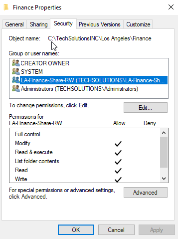

# Overview
I created a shared folder structure that mirrored the company layout. Company share (TechSolutionsINC) > location (Los Angeles & New York) > department folders (HR, Sales, IT, etc). Rather than sharing everything openly, I configured both Share and NTFS permissions to provide layered secure access control.

## Permission Configurations
* At the Share level, I kept it simple and allowed broader access. I allowed Read and Change access to Authenticated Users.
* At the NTFS level, I removed inheritance where needed and applied permissions using department-based security groups.

  

This allowed me to control exactly who could read or modify content.  
Trying to access New York Share and LA Finance Share as user Tupac (LA-Sales)

  
Accessing La-Sales Share as Tupac

## Lessons Learned
During testing, I noticed users couldn’t create files in their department folders even though they had Modify permissions at the NTFS level. Initially I assumed it was an NTFS misconfiguration, but after reviewing both layers, I realized the issue was at the Share level. The Share permissions were more restrictive than I intended. Since the most restrictive permission between Share and NTFS takes precedence, users were effectively limited despite having proper NTFS rights. This helped reinforce how Share and NTFS permissions work together. Even if NTFS is configured correctly, overly restrictive Share permissions will still block access. After correcting the Share permissions, file creation worked as expected.
