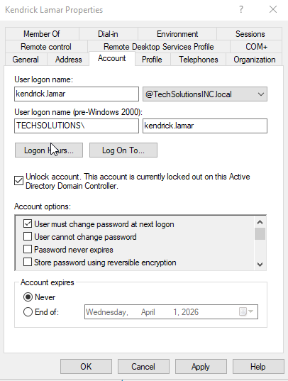

# Ticket #2: Account Lockout

## Scenario
User Kendrick Lamar (Sales Department) reported he was unable to log in to his workstation. The user stated he was certain he was entering the correct password but continued receiving an “Account locked out” message.

Key Details:
* User: Kendrick Lamar
* Department: Sales
* Issue: Unable to log in
* Error Message: "The referenced account is currently locked out"

## Environment / Context
* Windows Server 2019 Domain Controller
* Active Directory Domain Services User and Computers
* Account Properties

## Investigation
1. Attempted to replicate the issue at the user's workstation
2. Confirmed an error message indicating an account lockout

3. Checked Domain Controller Security Logs via Event Viewer
4. Located Event 4740 (account lockout) and event origin

5. Checked Active Directory Users and Computers (ADUC) for Kendrick Lamar's account properties
6. Verified the user account was locked

## Root Cause Analysis
The user account was locked due to multiple failed login attempts, triggering the domains account lockout policy threshold.

## Remediation / Validation
* Unlocked user Kendrick Lamar's account on the Domain Controller via account properties tab
* Configured a temporary password and enabled "User must change password at next logon" to allow the user to configure a new password

* Verified user connectivity by successfully logging on

## Lessons Learned
Account lockouts can occur for various reasons, such as mistyped passwords, failure to update a password, or cached old credentials on a system. It's always best practice to review the event logs to identify the source of the lockout. Repeatedly unlocking an account without performing root cause analysis can lead to recurring issues; therefore, always determine the origin of the lockout before unlocking the account.
