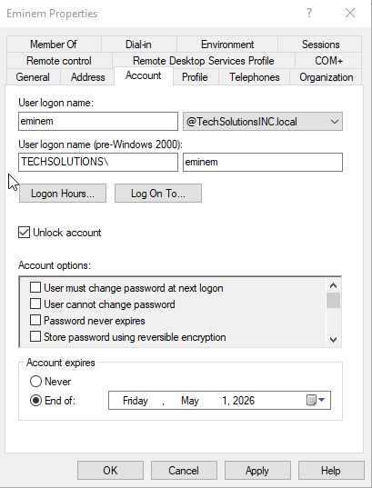

# Ticket #3: Account Expired Scenario
## Scenario
A user reported they were unable to log into their domain account. The account belonged to an Intern named Eminem. The user stated they were able to access the system previously but were now receiving an authentication error when attempting to sign in.  
Key Details:
* User: Eminem
* Department: IT
* Issue: Unable to login
* Error Message: "The user's account has expired."

 ## Environment / Context
 * Windows Sever 2019 Domain Controller
 * Active Directory Domain Services Users and Computers
 * Account Properties

## Investigation
1. Attempted to replicate the issue at the users workstation to verify the account has expired.

2. Reviewed the user's account properties in Active Directory and noticed that the account has reached its configured expiration date.

## Root Cause Analysis
The issue occurred because the user account had reached its configured account expiration date in Active Directory. Once the expiration date was reached, the account was automatically prevented from authenticating to the domain.

## Remediation / Validation
1. Unlock user account.
2. Extend account expiration date as needed.  

4. Successfully logging in as user Eminem.

## Lessons Learned
Account expiration is commonly used in environments where temporary workers, contractors, or part-time staff require access for a limited time period. Once the expiration date is reached, the account automatically becomes unusable until an administrator updates the account settings.  

This scenario reinforced how account expiration can be used as a security control for temporary staff. Instead of manually disabling accounts when a contract ends, administrators can configure an expiration date when the account is created. This helps reduce the risk of inactive accounts remaining active longer than intended.  

It also highlighted the importance of verifying the root cause of an account lockout before making changes. Lockouts can occur for several reasons such as incorrect password attempts, expired accounts, or cached credentials, so checking the account properties first helps avoid unnecessary troubleshooting.  
